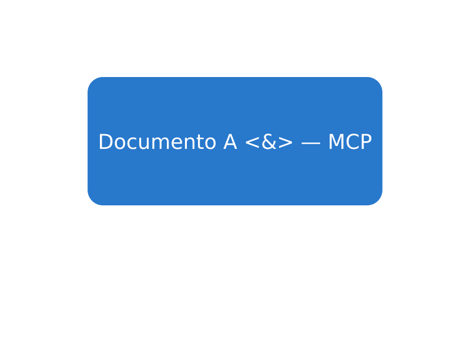

# Inkscape MCP

**Give an MCP agent a working SVG toolbox and access to your open Inkscape drawing.**

Inkscape MCP connects [Inkscape](https://inkscape.org/) to MCP clients through
FastMCP. Create SVG from XML, edit paths, inspect documents, export previews, and
insert editable artwork into the desktop document you are already working on.
Ordinary drawing and export operations do not require a separate language model
service.

[Install](INSTALL.md) · [Tool reference](docs/TOOLS.md) ·
[Examples](docs/USAGE.md) · [Configuration](docs/CONFIGURATION.md) ·
[Contribute](CONTRIBUTING.md)

## What works where

| Workflow | What it does | Requirements |
| --- | --- | --- |
| File automation | Construct SVG, inspect objects, apply path operations, export files | Python 3.12+, Inkscape CLI |
| Live drawing | Read unsaved artwork; insert shapes and text with a native extension and readback verification | Linux desktop, Inkscape 1.3+, `gdbus`, bundled extension |
| Agent previews | Render PNG previews and inspect SVG quality | Inkscape CLI |
| MCP connection | stdio for local clients; Streamable HTTP for network clients | An MCP client |
| Optional dashboard | Browser interface, REST helpers, layers, animation, local model settings | Bun for the frontend; HTTP backend |
| Optional generation | Generate SVG with the client's sampling model or dashboard providers | A compatible sampling client, or a configured dashboard provider |
| Asset pipelines | Icon sheets, fabrication exports, staging for other graphics tools | Additional applications for external handoffs |

**Tested environment:** Ubuntu 26.04.1 LTS, Python 3.12.14, Inkscape 1.4.4.
The test desktop runs GNOME Wayland. Desktop checks and file-based runtime
checks exercise separate integration paths.
The test suite also passes with Python 3.13.15 and Inkscape 1.4.3 in a clean
Ubuntu 26.04 container. That container runs the two-window acceptance test
under Xvfb with Python 3.12.
Windows and macOS have CLI support; the live extension bridge targets Linux.
See [installation](INSTALL.md) for platform details and native dependencies.

## Quick start on Ubuntu

Install [uv](https://docs.astral.sh/uv/getting-started/installation/), then:

```bash
sudo apt update
sudo apt install inkscape git build-essential pkg-config python3-dev \
  libcairo2-dev libgirepository-2.0-dev gir1.2-gtk-3.0 \
  libmagic1t64 libglib2.0-bin python3-numpy python3-lxml python3-scour \
  python3-cssselect python3-platformdirs

git clone https://github.com/GianluDeveloper/inkscape-mcp.git
cd inkscape-mcp
uv sync --python 3.12
inkscape --version
uv run inkscape-mcp --help
```

The GTK/Cairo build packages are needed by `inkex` and its Python dependencies;
installing Inkscape alone may not be enough for `uv sync`.
The system Python packages are also required: Inkscape runs native extensions
with its own interpreter, independently of the server's uv environment.

Configure a local MCP client using its server configuration format. A client
that accepts `mcpServers` can use:

```json
{
  "mcpServers": {
    "inkscape-mcp": {
      "command": "uv",
      "args": [
        "--directory", "/absolute/path/to/inkscape-mcp",
        "run", "inkscape-mcp", "--mode", "stdio"
      ]
    }
  }
}
```

Use an absolute path to `uv` too if your client cannot find it. Restart the MCP
connection after installation or code updates, then call `inkscape_system` with
`{"operation":"status"}`. Check `data.inkscape.available` in the response.

## Draw in the open Inkscape document

Run the MCP server in the same logged-in desktop session as Inkscape. Install
the bundled native extension once by calling `inkscape_system` with:

```json
{"operation": "install_live_extension"}
```

Restart any Inkscape windows that were already open so they load the extension.
Then, with one window in the ordinary desktop instance, call:

```json
{"operation": "draw_test", "session_id": "desktop", "text": "Prova MCP OK"}
```

A blue rounded rectangle and editable text are inserted into the existing drawing.
The server reads live SVG before and after the effect, checks the inserted
objects, and returns their IDs with `data.verified: true`. Existing objects and
Inkscape's undo history are preserved; **Edit → Undo** removes the insertion.
The native effect uses SVG coordinates and does not take over the clipboard.



This is a real Inkscape export from the two-document desktop acceptance test.
The [editable SVG](examples/live-demo.svg) is included with the examples.

Use `{"operation":"active_document","session_id":"desktop"}` to inspect the
current SVG, including unsaved edits. For your own artwork, call `insert_svg` with
a complete `svg_content` document and the target `session_id`.

To save changes in that window to its current SVG filename, call `inkscape_system`:

```json
{"operation": "save_document", "session_id": "desktop"}
```

The server verifies the saved content and returns `data.verified: true` and
`data.live_document_saved: true`. It uses Inkscape's current filename, including
changes made with **File → Save As**. For an unnamed drawing, use **Save As** in
Inkscape first, or start a named drawing with `new_document`.

### Work with several documents

Use `new_document` with a new `output_path`, or `open_document` with an existing
SVG `input_path`. Each opens an independently addressed Inkscape instance and
returns a `session_id`. Pass that ID to subsequent inspection, drawing, saving,
and closing operations; keyboard focus does not choose the target.

```json
{"operation": "new_document", "output_path": "/absolute/path/to/drawing.svg"}
```

`list_documents` discovers live sessions. `save_document` saves either a managed
document or the single-window `desktop` to its current filename. An `output_path`
different from that filename is rejected before saving; change the filename
through Inkscape's **Save As** dialog. `save_copy` writes live content to another
`output_path` while keeping the GUI filename; pending changes in the open
document still need to be saved.
`close_document` requests a normal close of a managed session and preserves
Inkscape's unsaved-changes dialog.

See [the multi-document procedure](docs/USAGE.md#work-with-multiple-documents)
for complete requests. An ordinary `desktop` instance with several windows is
ambiguous; use managed sessions for separate drawings. If an edit cannot be
verified, inspect its target before retrying. [Troubleshooting](docs/TROUBLESHOOTING.md)
covers extension loading and session access.

## Create and export a file

Call `inkscape_vector`:

```json
{
  "operation": "construct_svg",
  "output_path": "/absolute/path/to/demo.svg",
  "svg_content": "<svg xmlns=\"http://www.w3.org/2000/svg\" width=\"160\" height=\"80\" viewBox=\"0 0 160 80\"><rect x=\"10\" y=\"10\" width=\"140\" height=\"60\" rx=\"12\" fill=\"#2878cc\"/></svg>"
}
```

Then call `inkscape_file`:

```json
{
  "operation": "convert",
  "input_path": "/absolute/path/to/demo.svg",
  "output_path": "/absolute/path/to/demo.png",
  "format": "png"
}
```

Managed CLI exports validate the produced artifact before replacing the
destination. Failed commands, timeouts, and cancellation preserve an existing
destination. File operations work on the supplied paths; live drawing operations
work on the open desktop document. See [examples](docs/USAGE.md) for previews,
boolean operations, and a repeatable live drawing check.

## HTTP and the optional dashboard

```bash
uv run inkscape-mcp --mode http --host 127.0.0.1 --port 11028
```

Connect an HTTP MCP client to `http://127.0.0.1:11028/mcp`. For the optional web
interface, run in a second terminal:

```bash
cd web_sota
bun install --frozen-lockfile
bun run dev
```

Open `http://127.0.0.1:11029`. The frontend proxies to port `11028`; the standalone
CLI HTTP default is `11027`. `--mode dual` is retained as an HTTP alias and does
not start a second stdio listener.

## Scope and current limits

The [tool reference](docs/TOOLS.md) lists the registered MCP interface and marks
incomplete operations. Some Python/REST capabilities, including layer and
animation helpers, are not standalone MCP tools. External asset handoffs require
the corresponding services. Sampling tools require client support for
`sampling.tools`; workflow planning tools return plans, which the caller must
execute through the editing tools.

This server can read and write local files and send commands to Inkscape. HTTP
binds to loopback by default; use it within a trusted local environment. Detailed
configuration and directory restrictions are described in
[Configuration](docs/CONFIGURATION.md).

## Development and project history

```bash
uv sync --group dev
uv run pytest
```

See [Development](docs/DEVELOPMENT.md) for focused tests, real Inkscape checks,
formatting, and the repository layout. Contributions should include a reproducible
problem or a working example, appropriate tests, and updated tool documentation.
See [CONTRIBUTING.md](CONTRIBUTING.md).

## Credits

- [sandraschi/inkscape-mcp](https://github.com/sandraschi/inkscape-mcp) is the base
  project continued by this repository. Its server, tooling, and original MIT
  attribution are retained.
- [aravindev/inkscape_mcp](https://github.com/aravindev/inkscape_mcp) informed the
  native live-editing extension and document/session design. Adapted components
  retain their upstream attribution; action discovery is independently implemented.

See [Upstream integration](docs/UPSTREAM_INTEGRATION.md) for the reviewed revision
and implementation boundaries. Attribution is recorded in [NOTICE.md](NOTICE.md).
Distributed under the [MIT license](LICENSE).
Report reproducible problems in
[GitHub Issues](https://github.com/GianluDeveloper/inkscape-mcp/issues).
