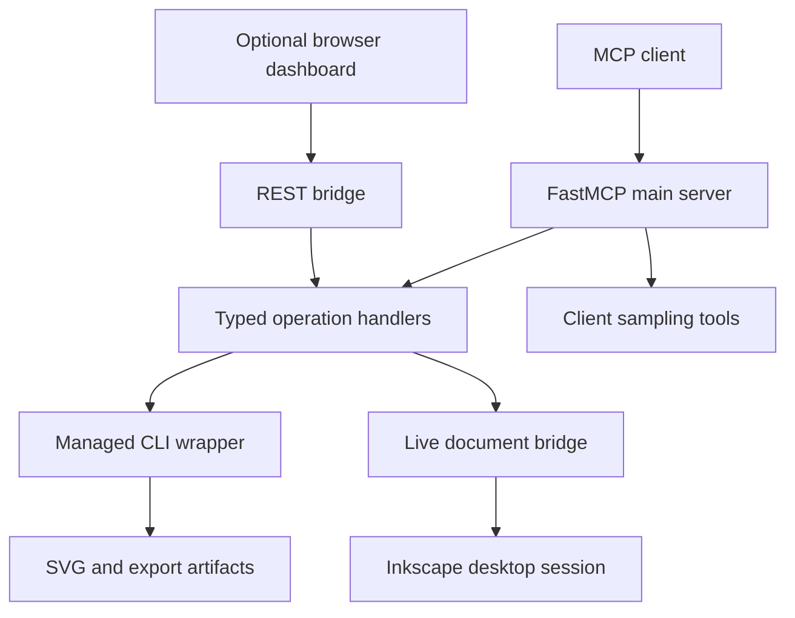

# Architecture

The server has three main boundaries: MCP requests, managed Inkscape CLI work,
and optional desktop document control. The browser dashboard adds a REST client
surface around part of the same Python code.

## Main entry point

`inkscape_mcp.main:main` parses configuration and transport arguments, discovers
the executable, creates the CLI wrapper, and registers MCP tools, prompts, and
resources. Legacy launchers delegate to this entry point. stdio is the default;
HTTP hosts MCP at `/mcp` and mounts optional REST helpers.

Public wrapper parameters in `main.py` and operation aliases in
`mcp_tool_types.py` define the agent-accessible interface. Internal Python helpers
can expose more operations than those wrappers. The MCP `tools/list` schema is
the contract clients actually receive.

## File execution

Handlers construct an argument vector for the CLI wrapper. The wrapper validates
paths and action chains, limits concurrent processes, enforces timeouts, and
reaps children on cancellation. Managed exports use staging files adjacent to
the destination, check the produced artifact, and replace the destination only
after success. A failed export preserves the existing destination.

Batch operations work from file paths and use isolated application identifiers.
They do not represent edits to the user's unsaved desktop document.

## Live document execution

The live path targets the running desktop application and must reach its user
session. Native extension execution provides an undoable document edit. Managed
application sessions allow individual documents to be addressed without relying
on whichever window currently has keyboard focus.

Request correlation, per-target serialization, and live document readback help
distinguish a verified mutation from a command that was merely dispatched. An
unverified mutation must not be blindly retried. Cross-process coordination and
external user edits remain separate concerns from the CLI process semaphore.

See [Upstream integration](UPSTREAM_INTEGRATION.md) for the extension/session
design and its provenance, and [Usage](USAGE.md) for the public workflow.

## Optional model and UI paths

MCP sampling helpers call the connected client's sampling API. Their workflow
helpers produce plans; ordinary file and desktop tools execute edits. Dashboard
SVG generation uses its separately configured local/cloud provider path.

The React/Vite dashboard in `web_sota/` proxies requests to the Python HTTP
backend. It is optional for MCP use. Prometheus support is also optional and
enabled only when its dependency and settings permit it.

## Configuration and validation

YAML config controls the executable, process limits, temporary paths, and managed
file restrictions. Environment/CLI settings control the transport and optional
providers. These are application settings, not an isolation boundary for hostile
clients. The server is intended to run with the user's authorized local file and
desktop access.

Tests cover tool schema/dispatch, CLI error handling and output checks, session
logic, and explicit real-Inkscape file operations. Live GUI checks need a desktop
and should be run intentionally against a known target document.
